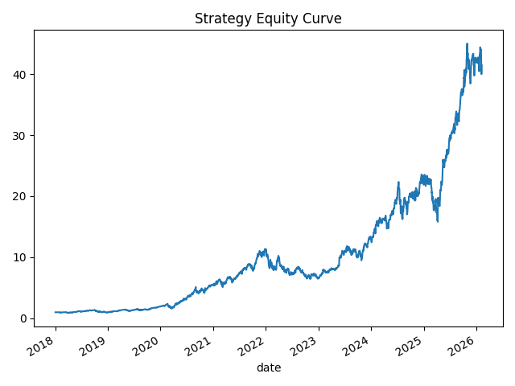

# Model Development Document (MDD)

**Project:** Quant Equity System (FinWorld Core)

**Date:** 2026-02-07

## 1) Objective
Design and evaluate an end-to-end quantitative stock selection system using FinWorld Alpha158 factors plus additional signals, with walk-forward training, portfolio construction, and explicit risk management. The system must be fully reproducible and data-driven using free public data sources.

---

## 2) Data & Universe
**Data Source:** Yahoo Finance via `yfinance` (auto-adjusted OHLCV).

**Universe (30 large caps):**
AAPL, MSFT, NVDA, AMZN, META, GOOGL, TSLA, AMD, AVGO, ASML, JPM, JNJ, XOM, PG, UNH, HD, COST, PEP, KO, DIS, BAC, WMT, V, MA, PFE, ABBV, CRM, ORCL, INTC, QCOM.

**Benchmark:** SPY (downloaded but used only for optional comparison).

**Date Range:** Start 2018-01-01 (configurable in `src/config.py`).

---

## 3) Feature Engineering
**Core engine:** FinWorld `Alpha158` factor set (OHLCV-based). Each ticker is processed independently to avoid cross-asset leakage.

**Additional features (derived):**
- `mom_12m`: rolling mean of 60‑day ROC (proxy for 12‑month momentum).
- `vol_20`: 20‑day volatility from Alpha158 (`std_20`).

**Key design notes:**
- All factors computed on historical OHLCV only.
- No forward-looking data is used in feature calculation.

---

## 4) Model
**Type:** Ridge regression (linear, L2-regularized).

**Target:** 1‑month forward return (21 trading days).

**Features used:**
- `mom_12m`
- `vol_20`
- `ma_20`
- `std_20`
- `roc_10`
- `roc_20`

**Training protocol:**
- Walk‑forward: at each rebalance date, the model is trained on all data up to **t‑1**.
- Scoring uses only data available at rebalance date.

---

## 5) Portfolio Construction
**Selection:** Top‑N ranked stocks by model score.

**Sizing:** Inverse volatility weights.

**Constraints:**
- Max single position: 15%
- Re‑normalized after capping

**Rebalance frequency:** Monthly (last trading day of month).

---

## 6) Risk Management
**Volatility targeting:** 15% annualized (rolling 63‑day vol).

**Drawdown control:** Reduce exposure by 50% if drawdown worse than −20%.

**Transaction costs:** 10 bps per turnover.

---

## 7) Backtest Engine
Daily PnL computed with explicit weights, turnover costs, and scaling from risk controls.

Outputs saved to:
- `outputs/daily_returns.csv`
- `outputs/metrics.csv`
- `outputs/equity_curve.png`

---

## 8) Results (latest run)
**Metrics:**

| CAGR | Volatility | Sharpe | Sortino | Max Drawdown | Avg Daily Turnover |
|---:|---:|---:|---:|---:|---:|
| 1.0777 | 0.6300 | 1.7106 | 2.3320 | -0.6450 | 0.0286 |

**Equity Curve:**



---

## 9) Model Outputs
- **Daily returns series** (`outputs/daily_returns.csv`)
- **Performance metrics** (`outputs/metrics.csv`)
- **Equity curve plot** (`outputs/equity_curve.png`)

---

## 10) Limitations & Future Work
- Universe is limited to 30 large caps (can be expanded).
- No sector constraints due to lack of free sector data.
- Factor library is OHLCV‑based only; no fundamentals.
- Ridge regression is a baseline; could be replaced with tree‑based or nonlinear models.

---

## 11) Reproducibility
Run end‑to‑end:
```bash
python scripts/run_all.py
```
All outputs are regenerated deterministically from public data.
